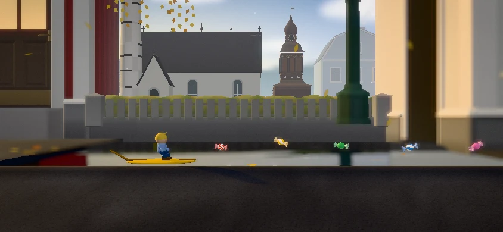

# Byn: Bredbyn architecture review

Checkpoint from `codex/byn-bredbyn-identity`, 10 October 2026. These are captures of
the game's renderer, chapter, simulation and installed public asset packs. Elof
uses the public stand-in. No reference photograph or private character asset is
included in this gallery.

The five main pictures show an actual leaf ride at approximately x48 in Byn.
The fixture boards the leaf using the game's action, advances the simulation to
that point, and lets the gameplay camera settle. It then holds the simulation
still for the review picture. The fixture displays the canvas without the game's
DOM controls or dialogue, so these pictures review environment composition and
character readability rather than touch-control layout.

| Viewport | Tier | Capture |
| --- | --- | --- |
| 390 × 844 | High | [Portrait phone](390x844.webp) |
| 844 × 390 | High | [Landscape phone](844x390.webp) |
| 780 × 360 | High | [Short landscape phone](780x360.webp) |
| 1180 × 820 | High | [Tablet](1180x820.webp) |
| 1440 × 900 | High | [Desktop](1440x900.webp) |

The church, bell tower and varied street architecture are original procedural
geometry studied against the sources in the [reference study](../../bredbyn-reference-study.md).
The composition is adapted to the game camera and existing route. It is not a
measured reconstruction of the street or a claim about its exact current layout.
The landscape vista shows one pale blue facade beside the bell tower; the authored
street banks contain six buildings, but these are not all visible from the path.
Portrait framing crops the left end of the nave while retaining its white wall,
steep roof and the separate tower's crown and clock face.

`node tests/browser/bredbyn.mjs` recreates the review after `npm run assets`.
It checks landmark uniqueness, projected visibility against opaque scenery,
space above the roof ornaments, real leaf boarding, rendering budgets, stable
geometry/textures/programs, unchanged simulation progress while rendering,
pause and reduced motion. It also covers Low on both phone orientations,
the ride's shore boundaries and the `look-street` preview. Working PNGs and
measurement JSON remain under ignored `docs/shots/_work/bredbyn/`.

The final run passed 70 checks across 12 cases, with 43–67 draw calls. After a
production build, `GPU_COURSE=byn node tests/browser/gpu-memory.mjs` also passed
14 checks, including quality/viewport changes, pause cycles and context restoration.
This checkpoint passed 70 checks across 12 cases, with 43–67 draw calls. The
shore-boundary checks keep Elof and the next obstacle readable; the complete
landmark vista belongs to the middle of the crossing. The `look-street` preview
retains its close street-detail framing and shows only a roof glimpse behind its
higher fence.

These captures establish composition with public stand-ins. Physical-device
frame timing, final likeness assets and Olov's comparison with present-day
Bredbyn still need review on his devices. Reference originals remain outside
the public repository; the source links and provenance record are retained.
